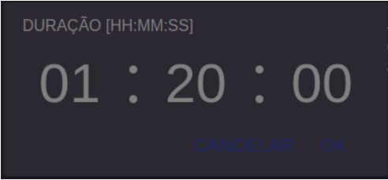

# React Dynamic Tabs

A React component that offer a variation of time-picker component that let the user select a range of time.

##  Installation

To install the `react-custom-duration-picker` package, run the following command:

```
npm install react-custom-duration-picker
```

## Usage

1. Import the `DurationPicker` component from the `react-custom-duration-picker` package:

```
import DurationPicker from 'react-custom-duration-picker';
```
2. Render the `DurationPicker` component in your React app and set the initial state:
```
<DurationPicker
  duration={ */ time range in seconds /* }
  onSubmit={() => { */ your function /* }}
/>
```

## View



## Contributing

If you would like to contribute to the `react-dynamic-tabs` package, please fork the repository and submit a pull request with your changes.

## License

This project is licensed under the ISC License. See the [LICENSE](https://www.isc.org/licenses/) file for details.

## Contact

If you have any questions or comments, please email me at gustavobmachado105@gmail.com.

